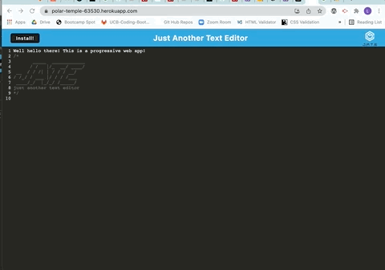

# J.A.T.E. - Just Another Text Editor
## Lauren Darrimon
    
    
### Description
Full-stack progressive web application (PWA) with data persistence techniques and offline capabilities for using an IndexedDB database with an idb wrapper.

### Table of Contents

* [Link](#link)
* [Installation](#installation)
* [Usage](#usage)
* [PWA](#pwa)
* [Contributing](#contributing)
* [Questions](#questions)
* [License](#license)

### Link 
🔗 
Link to application [J.A.T.E. - Just Another Text Editor](https://polar-temple-63530.herokuapp.com/)

### Installation
🔧
In order to recompile this application for yourself, you need to install the following (dependencies): 
Node.js, Express.js, Concurrently, nodemon, Babel, Webpack, and Workbox Webpack Plugin. As long as you have Node.js, everything else is listed in the package.json amd will be insatlled with a simple: 
~~~
npm i 
~~~

If you make any changes in the source files (src directory) for you text editor, you will need to rebuild the Webpack, using: 
~~~
npm run start:dev
~~~

### Usage 

To run the application from the command line: 
~~~
npm run start
~~~

Then open your browser at localhost:3000/ to see the application luanched from the distribution directory. 

### PWA 

This is a progressive web application, that can be installed on your local machine and/or run offline. 

### Contributing 
✍️ 
Lauren Darrimon is the author of this application. Find additional work on Lauren Darrimon's [Github profile.](http://github.com/laurenDarrimon).

### Questions
❓💌
Reach out to Lauren Darrimon at hello@laurenlalita.com if you have any questions. 

### License
The license for this project is: [MIT](https://opensource.org/licenses/MIT)

